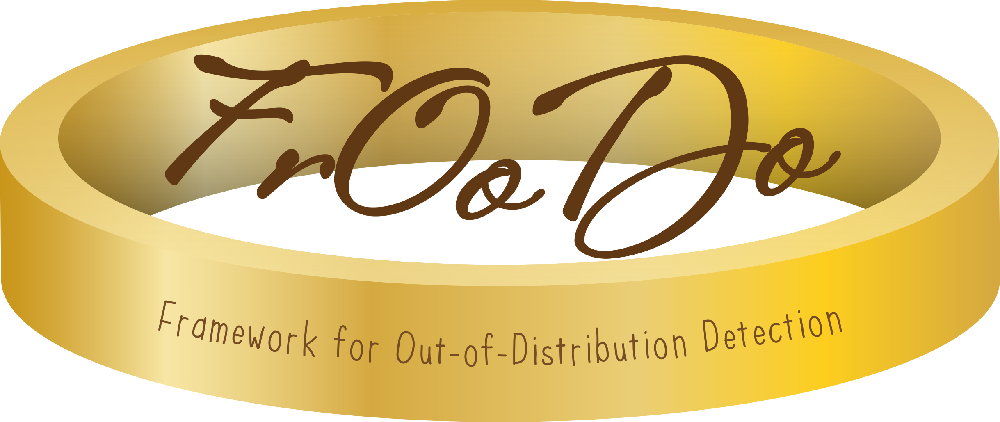
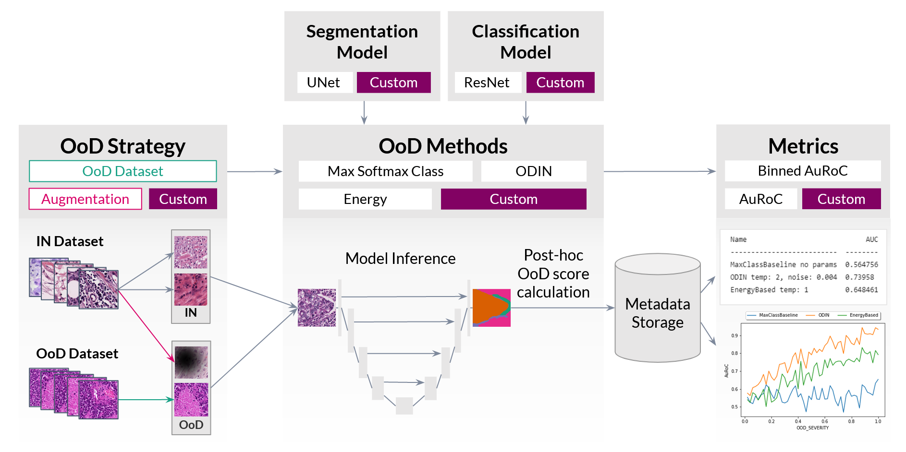

# FrOoDo - Framework for Out of Distribution Detection
[](LICENSE)
[](https://github.com/MECLabTUDA/FrOoDo/tree/main/docs)
 

A Pytorch framework for Out-of-Distibution Detection. The technical report can be found at https://arxiv.org/abs/2208.00963.

If you use this framework in one of your projects please consider to cite 

```
@misc{FrOoDo2022,
      title={FrOoDo: Framework for Out-of-Distribution Detection}, 
      author={Stieber, Jonathan and Fuchs, Moritz and Mukhopadhyay, Anirban},
      year={2022},
      eprint={2208.00963},
      archivePrefix={arXiv},
      primaryClass={cs.CV}
}
```

## Introduction

 

This framework is made to tackle the problems of out of distrubtion data in digital pathology. During the data aquisition process different types of out of distribution data can occur e.g. artifacts like fat drops or unfocssed parts of the whole slide image. These ood data lower the segmentation metrics like the dice score in a critical way and it is therefore necessary to identify and remove ood data for the automatic segmentation with neural networks.

Currently the framework supports the augmentations below. The artifact images are taken from [1]. As you can see the severity of the augmentation can be chosen:

 

The framework is designed to be as flexible as possible to fit different types of experiments. As described in the framework overview it is possible to quickly add new models, new ood methods, new datasets and new metrics. Therefore you can focus on your specific research question and let the framework do the rest.


## Installation


```
git clone https://github.com/MECLabTUDA/FrOoDo
cd froodo
pip install -r requirements.txt
```

## Demo

This demo shows a typical ood evaluation scenario. A pathology dataset (in this case the BCSS dataset [2] ) is augmented with dark black spots which are marked as ood pixels. The images are then fed into a neual network and and ood score is comoputed with well known post-hoc ood methods (Odin [3] and Energy-Based [4] ). 

These scores are used by the AuRoc Metrics to calculate the seperability of in and ood data. Because of the augmentation there is information about the percentage of ood pixels in an image and the scores can therefore be calculated for different numbers of percentages.

You can find this demo [here](demo.ipynb).

A guide on how to install the BCSS dataset for FrOoDo can be found [here](docs/datasets/BCSS.md).

### Code
```python
from froodo import *

# init network
net = SegmentationModel().load()

# create BCSS dataset adapter (see BCSS docu)
adapter = GeneralDatasetAdapter(BCSS_Adapted_Cropped_Resized_Datasets().test)

# choose metrics
metrics = [OODAuRoC()]

# choose post-hoc OOD methods
methods = [MaxClassBaseline(), ODIN(), EnergyBased()]

# create experiment component
experiment = AugmentationOODEvaluationComponent(
    data_adapter=adapter,
    augmentation=SampledAugmentation(DarkSpotsAugmentation()),
    model=net,
    metrics=metrics,
    methods=methods,
    seed=4321,
    task_type=TaskType.SEGMENTATION
)

# run experiment
experiment()
```
### Output

The output of en experiment will be a sample of the evaluation data so see the correct augmentaion and the chosen visualized metrics.

 

 


## Manual

The main advantage of froodo is that it can be extend easily because of clear defined interfaces. The manual pages describe how to e.g. add an augmentation or new ood method. 


Title | Explanation|  Link
-- | :-- | :--:
 Create new **Post-hoc OOD methods** | Learn how to implement your own post-hoc ood methods and how to evaluate it on your datasets |  [here](docs/NEW_METHOD.md)
Create new **metrics** for your experiments | Evaluation is all about choosing the correct metrics for your experiment. Learn how to create new metrics and how to save the data in container during the experiment | [here](docs/NEW_METRIC.md)
All you need to know about **augmentations** | Extend the framework with new pathology augmentations and directly evaluate them without any change | [here](docs/AUGMENTATION.md)
Dataset Adaptation | The frameworks uses an object "Sample" to process the input. Therefore your dataset needs to be adapted to this standard. Learn how to use the default adapters or how tpo create an own adapter for a more complex dataset | [here](docs/DATASET_ADAPTER.md)
Different **OOD Strategies** | Besides augmentation there are other types of ood data. Learn which ood types are already included and how to create a new one | [here](docs/OOD_STRATEGY.md)
How does the framework works internally?| Deep dive into the frameworks internal processes to better understand how it works and where possible errors can occur  | tbd
Dataset installation | For a quick start we provide an installation guide for the used datasets  | [here](docs/datasets/DATASET_OVERVIEW.md)

## Future Work

- Experiment tracking
- More augmentations, more models, more methods, more ...

## References
[1] Schömig-Markiefka, B., Pryalukhin, A., Hulla, W., Bychkov, A., Fukuoka, J., Mad-
abhushi, A., Achter, V., Nieroda, L., Büttner, R., Quaas, A., et al.: Quality control
stress test for deep learning-based diagnostic model in digital pathology. Modern
Pathology (2021)

[2] Amgad, M., Elfandy, H., Hussein, H., Atteya, L.A., Elsebaie, M.A., Abo Elnasr,
L.S., Sakr, R.A., Salem, H.S., Ismail, A.F., Saad, A.M., et al.: Structured crowd-
sourcing enables convolutional segmentation of histology images. Bioinformatics
(2019)

[3] Liang, S., Li, Y., Srikant, R.: Enhancing the reliability of out-of-distribution image
detection in neural networks. In: International Conference on Learning Represen-
tations (2018)

[4] Liu, W., Wang, X., Owens, J., Li, Y.: Energy-based out-of-distribution detection.
Advances in Neural Information Processing Systems (2020)


